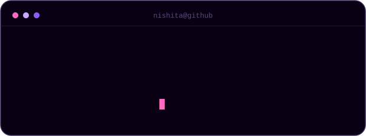
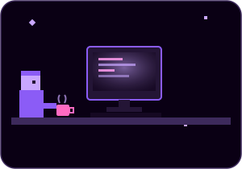
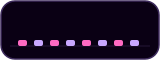

 

 nishita, status -> online">

  

 

cs student · occasional designer · professional overthinker

night owl, chronic tea drinker. talks to a rubber duck more than humans. believes bugs are just undocumented features.

 

&nbsp;&nbsp;

♫ Compass — The Neighbourhood

 

learning → C++ / Java / DSA  
building → little things  
exploring → web + design  
status → probably debugging

 

C++ · Java · HTML · CSS · JavaScript · SQL · Git · GitHub · VS Code

 

<a href="https://github.com/nishik2811-cell">github</a> ⋆ <a href="https://www.linkedin.com/in/nishita-kumari-841227240/">linkedin</a>

 

